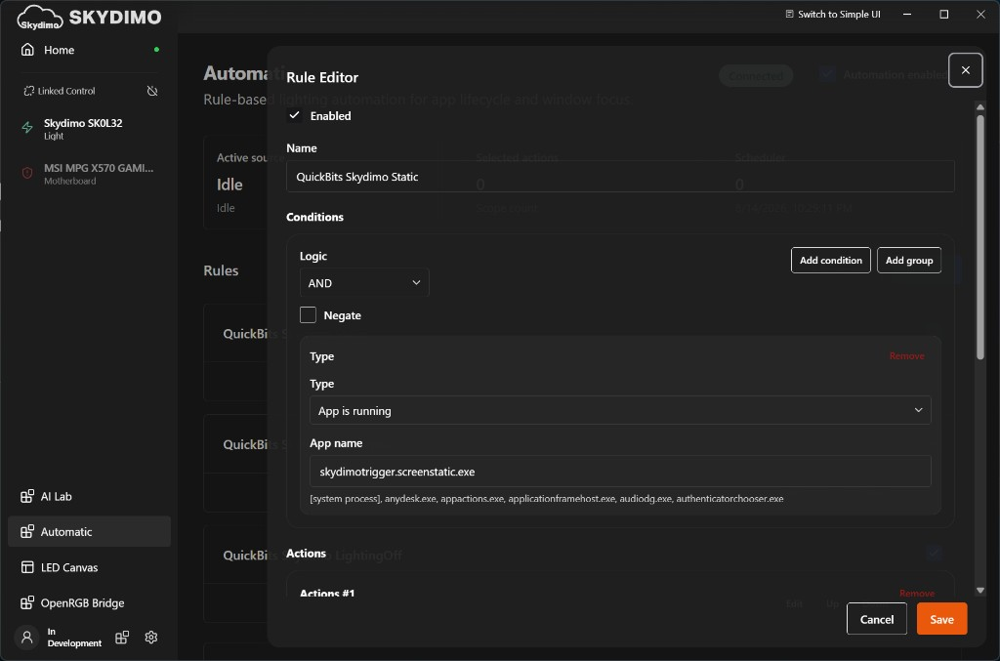
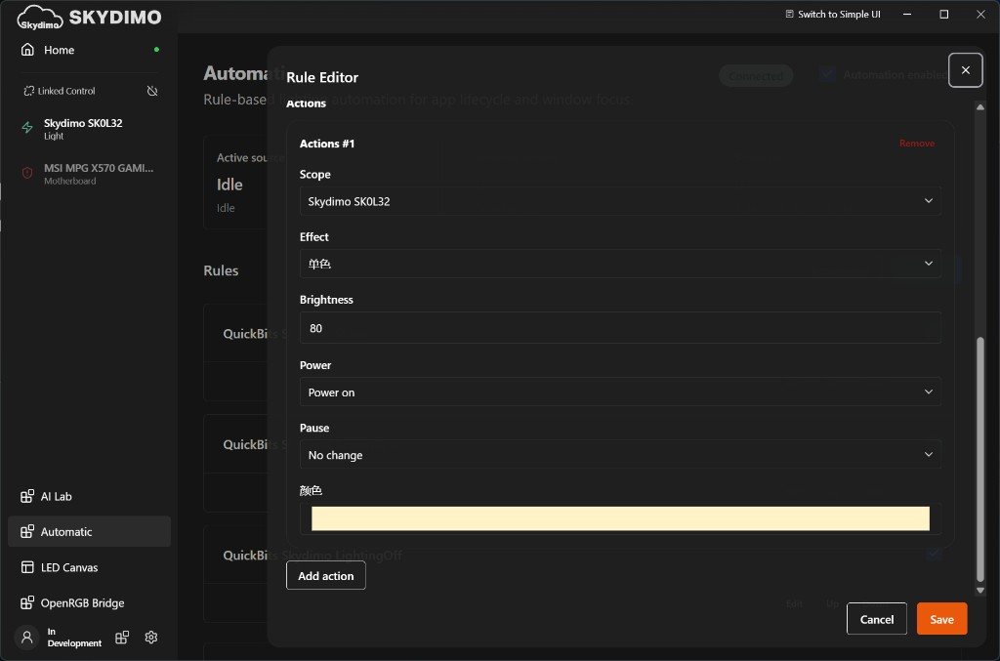

# StreamDeck QuickBits

[](#requirements)
[](#requirements)
[](LICENSE)

Personal [Stream Deck](https://www.elgato.com/stream-deck) plugin for **Windows**: volume, Do Not Disturb, optional [Skydimo](https://www.skydimo.com/) lighting, and Spotify.

Hobby project — not on the Elgato Marketplace. Plugin ID: `dev.aryapaw.quickbits`. Version: [`manifest.json`](dev.aryapaw.quickbits.sdPlugin/manifest.json).

## What you get

| Action | What it does |
|--------|----------------|
| Set Volume | Windows volume to a percentage |
| Toggle DND | Focus Assist / Do Not Disturb |
| Skydimo: lighting | Tap Sync ↔ Static, hold Off (needs Skydimo rules) |
| Spotify: Setup | Your Spotify Developer app + OAuth |
| Spotify: Now Playing | Art + play/pause from the local Spotify app |
| Spotify: Previous / Next | Skip via Windows media session |
| Spotify: Like | Liked Songs (Web API) |
| Spotify: Playlist Like | Heart for a playlist you pick in settings |
| Delete last recording | Short press: newest recent clip to Recycle Bin. Hold: restore it |

Playback does **not** need the Web API. Like and Playlist Like do.

## Requirements

- Stream Deck 6.9+
- Windows 10+
- [Bun](https://bun.sh)
- [.NET SDK 8](https://dotnet.microsoft.com/download) (helper + Skydimo triggers)
- [Stream Deck CLI](https://docs.elgato.com/streamdeck/cli/) on `PATH`

## Build and install

```powershell
bun install
bun run build
bun run link:deck
```

Installed plugin:

`%APPDATA%\Elgato\StreamDeck\Plugins\dev.aryapaw.quickbits.sdPlugin\`

Logs:

`%APPDATA%\Elgato\StreamDeck\Plugins\dev.aryapaw.quickbits.sdPlugin\logs\dev.aryapaw.quickbits.0.log`

## 🎵 Spotify

1. Add **Spotify: Setup** and open its page (or `http://127.0.0.1:5789/` while the plugin runs).
2. Create a Spotify Developer app. Redirect URI: `http://127.0.0.1:5789/callback`.
3. Enable Web API. Scopes:
   - `user-library-read` / `user-library-modify` (Like)
   - `playlist-read-private` / `playlist-modify-public` / `playlist-modify-private` (Playlist Like)
4. Authorize with the **same account** as Spotify desktop.

Client ID/Secret stay in Stream Deck settings — not in git.

Debug (localhost only): `http://127.0.0.1:5789/debug`

## 💡 Skydimo lighting

Optional. Skip if you do not use Skydimo.

The key does not call a Skydimo API. It flashes a tiny `.exe`; you tell Skydimo **when that process is running, change the lights**.

| Key | Helper | Rule name | Process in the rule |
|-----|--------|-----------|---------------------|
| Tap → Sync | `SkydimoTrigger.ScreenSync.exe` | QuickBits Skydimo ScreenSync | `skydimotrigger.screensync.exe` |
| Tap → Static | `SkydimoTrigger.ScreenStatic.exe` | QuickBits Skydimo Static | `skydimotrigger.screenstatic.exe` |
| Hold → Off | `SkydimoTrigger.LightingOff.exe` | QuickBits Skydimo LightingOff | `skydimotrigger.lightingoff.exe` |

Helpers live in `dev.aryapaw.quickbits.sdPlugin/triggers/` after `bun run build`.

### Fast setup (JSON)

Ready-made rules: [`docs/skydimo/quickbits-automation.json`](docs/skydimo/quickbits-automation.json)

Skydimo stores automations here:

`%APPDATA%\com.skydimo.desktop\data\<id>\config.json`

The `<id>` folder is created by Skydimo (look under `data\`). Do not copy someone else’s folder name.

1. In Skydimo, note your light’s **port** (Devices). The sample uses `COM6`.
2. In `quickbits-automation.json`, replace every `"COM6"` with that port.
3. **Quit Skydimo.**
4. Open your `config.json`. If you have no rules yet, replace the file with the sample. If you already have other rules, copy the three objects from the sample `"rules"` array into your `"rules"` array (do not drop your existing ones).
5. Start Skydimo → **Automatic** → **Automation enabled**. You should see the three QuickBits rules.

The sample Static color is `#fff3c7` at brightness 80; change it in the Rule Editor if you want.

### Manual setup

1. Skydimo → **Automatic** → **Add Rule** (three times).
2. Condition: **AND**, type **App is running**, app name from the table.



3. Action: your device as **Scope**. Sync = screen mirror. Static = single color. Off = power off.



### Button

- Short tap: Sync ↔ Static (from Off, next tap is Static).
- Long press (~650 ms): Off.
- Icon = last trigger the plugin fired, not live Skydimo state.

If Skydimo is at `C:\Program Files\Skydimo\Skydimo.exe`, the plugin waits for it on startup (up to 3 minutes) and fires Static once.

### Same idea for other apps?

These three helpers are baked into this plugin. If you want a small web UI to spawn custom trigger processes for other programs, [open an issue](https://github.com/AryaPaw/StreamDeck-QuickBits/issues) — that is not built yet.

Internals: [`docs/skydimo/implementation.md`](docs/skydimo/implementation.md).

## Layout

```
src/                          TypeScript plugin
helper/                       QuickbitsHelper.exe (local Spotify)
triggers/                     Skydimo WinForms helpers
docs/skydimo/                 Automation sample + screenshots
dev.aryapaw.quickbits.sdPlugin/
  manifest.json               Version + actions
  ui/                         Property Inspectors
  web/                        Setup + debug
  imgs/                       SVG icons
```

Runtime art cache (not in git): `%APPDATA%\Elgato\StreamDeck\Plugins\dev.aryapaw.quickbits.sdPlugin\cache\`

## Versioning

Bump the patch in `manifest.json` (`0.1.0.N`) when behaviour changes.

## License

[MIT](LICENSE)
